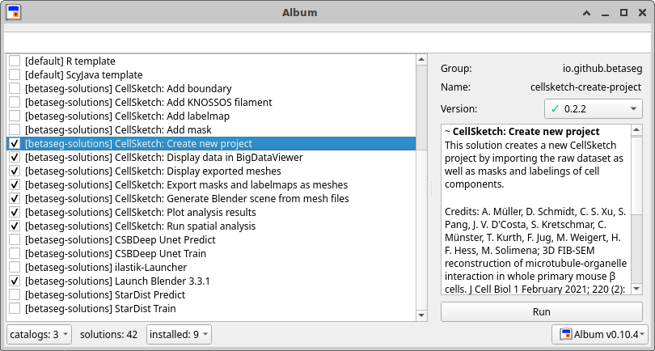

# CellSketch

## Aim of this document

This is an extensive guide covering all options of all CellSketch components.

## Installation

We are using [Album](https://album.solutions) to run the different CellSketch components.

### Install Album

Install Album by following the instructions [here](https://docs.album.solutions/en/latest/installation-instructions.html).

You can run the CellSketch solutions via command line or via graphical user interface (GUI).

### Add the Betaseg Project Catalog

Via commandline call
```
album add-catalog https://github.com/betaseg/solutions
```

Via GUI first launch Album. The installer of Album should have created a launcher for you, either on your desktop or in your list of applications. In the interface, click on `catalogs` in the bottom left corner, then click `Add catalog`. Enter the following URL: `https://github.com/betaseg/solutions` and confirm.

### Install CellSketch solutions

Via GUI, when running a solution which is not installed yet, it will ask you to install it first, so just confirm the installation whenever you launch one of the CellSketch solutions for the first time.



Via commandline install all CellSketch solutions by running the following commands:
```
album install io.github.betaseg:cellsketch-create-project:0.2.2
album install io.github.betaseg:cellsketch-pixel-view:0.2.1
album install io.github.betaseg:cellsketch-analyze:0.2.2
album install io.github.betaseg:cellsketch-plot:0.1.0
album install io.github.betaseg:cellsketch-mesh-export:0.1.0
album install io.github.betaseg:cellsketch-mesh-view:0.1.0
album install io.github.betaseg:cellsketch-to-blender:0.1.0
album install io.github.betaseg:launch-blender:0.1.0
```

## CellSketch routines

This documentation describes all existing routines.

We provide a test dataset:
- URL: https://syncandshare.desy.de/index.php/s/oxrzSiKbomiA9CZ
- pixel to micrometer factor: `0.016`
- all TIFs are isotropic and don't need to be scaled
- scale factors for Microtubule KNOSSOS XML: `X 0.25, Y 0.25, Z 0.2125`

Important note: The GUI is quite fresh and in an early stage. Be aware that processes launched from the GUI don't have a way of being canceled yet - you have to cancel them based on available methods for killing processes on your operating system.

### Creating a CellSketch project

In the GUI, after launching Album use the search bar or scroll through your list of solutions to find and run the `CellSketch: Create new project` solution.

Alternatively, run the solution via commandline:
```
album run io.github.betaseg:cellsketch-create-project:0.2.2 --parent MY_PARENT_FOLDER --name MY_PROJECT --input MY_RAW_DATASET.tif --pixel_to_um 0.016 --scale_z 1.5
```

Creating a new CellSketch project requires the following parameters:

Mandatory parameters:
- `parent`: Choose a folder, let's call it `MY_PARENT_FOLDER`, where your project is going to be created in.
- `name`: This name will represent your project, we will use the placeholder MY_PROJECT in this guide.
- `input`: You need to provide one dataset as the source image, for example your raw dataset from the data acquisition. It will only be used for visualization purposes as the "background image", if you don't have one, you can simply choose one of your masks. You should be able to use any image file format that ImageJ / Fiji can open as well.
- `pixel_to_um`: This is the conversion factor from pixel units to UM units.

Optional parameters:
- `scale_z`: Since spatial analysis and visualization is performed, we are first making sure our imported datasets are isotropic. In case they are not, you can use this parameter to provide a scale factor for the Z axis - the dataset will be rescaled in this case.

A new folder `MY_PARENT_FOLDER/MY_PROJECT.n5` will be created. Please don't rename it.

### Displaying the project in BigDataViewer and adding labels and masks

Via GUI you can display your CellSketch project by using the search bar or scrolling to the solution called `CellSketch: Display data in BigDataViewer`.

Alternatively, run the following command from the commandline:
```
album run io.github.betaseg:cellsketch-pixel-view:0.2.1 --project MY_PROJECT.n5
```
Provide the newly created `MY_PROJECT.n5` directory from the previous step as the project input parameter.


This will open BigDataViewer and initially always only display the source dataset. The view supports arbitrary rotations in 3D. Hover over the right part of the display - an arrow on the right border will appear. Click on it to show the sidebar of the viewer. After importing other cell components, they can be loaded and displayed by clicking on the eye symbols.

On the top of the right sidebar, there's a button called `Add dataset..`. It provides the following options:
- **Add mask**: Mask datasets have the value 0 as background and 255 as foreground. They mark a component of the cell, like the nucleus, without distinguishing between multiple entities of the same component.   
- **Add labels**: Labels can be imported as label masks. Multiple entities of the same component type can be encoded by giving each object a unique pixel value whereas 0 is used for marking the background. A label mask does not support overlapping labels.
- **Add boundary**: The boundary of the cell is a mask but plays a special role when analyzing the data. It describes the space which is available for components within the cell. Therefore, the boundary needs to be a filled mask, not just the membrane itself. CellSketch will automatically compute the outside border of this mask, add it as a cell component and call it `membrane`.
- **Add filaments from KNOSSOS**: In case you used KNOSSOS to annotate filaments, they can be imported using this option. The filaments are processed in the following fashion before being added to the project:
  - Since in our experience KNOSSOS ignored the first Z slices of the dataset without annotations, we add this offset based on comparing the number of Z slices of the KNOSSOS file with the number of Z slices of the source dataset of the project.
  - KNOSSOS annotations contain line elements bundled as "things" - each "thing" is initially considered a filament. The line elements are not necessarily in the right order which makes it difficult to compute analysis on the filament ends. Therefore, we sort the line segment of each "thing" and split them into multiple filaments in case there are more than two line ends without another line end of the same group close by. The resulting list of points per filament ist stored separately in YAML format and the basis of further analysis.
  - In order to compute distances and render the microtubules, CellSketch stores a labelmap based on the computed point list per filament stored as YAML as previously described. The labelmap can be displayed in the CellSketch viewer and later rendered just as the other labelmaps.

The options to add datasets share the following parameters:
- *Name*: The name of the cell component. Will be used for displaying the component, in table columns and in file names i.e. when exporting meshes.
- *Scale factor X/Y/Z for dataset*: In case the dataset needs to be scaled to match the (isotropic) dimensions of the source datasets, these scaling parameters can be used.
- *Color*: The dataset will be displayed using this color - it can be later adjusted in the viewer by clicking the colored rectangle on the right side of the dataset name in the list of components in the right sidepanel. 

Labels, masks and the boundary share these parameters:
- *Analyze connection to filaments ends*: Check this box if your project contains filaments and if you want the connection of their ends to the labelmap or mask to be analyzed.
- *Threshold to count filament ends as connected in um*: When calculating the distance between a mask or label with filaments, this threshold im micrometers is used to mark filaments as connected to this mask/label.  

To **delete an imported dataset**, click on the three dots next to the bold name of the component in the sidepanel on the right and click `Delete`.

### Spatial analysis

Spatial analysis can be performed by directly clicking the `Analyze` button in the right sidepanel of the viewer, however we highly advise running this separately without the viewer being opened. The analysis can be quite memory consuming. 

Run spatial analysis for your CellSketch project via GUI by using the search bar or scrolling to the solution called `CellSketch: Run spatial analysis`.

Alternatively, run the following command from the commandline (exemplary parameter values):
```
album run io.github.betaseg:cellsketch-analyze:0.2.2 --project MY_PROJECT.n5 --connected_threshold_in_um 0.02 --skip_existing_distance_maps True
```

Mandatory parameters:
- `project`: Your CellSketch project, the directory ending with `.n5`.
- `connected_threshold_in_um`: When analyzing how close two organelles need to be in order to be counted as connected, this is the threshold, provided in micrometers.

Optional parameters:
- `skip_existing_distance_maps`: Distance maps are most memory expensive to compute - in case the analysis process crashes because of memory issues, you can run the process again with this option checked. It will not recompute already computed distance maps. This has to be unchecked whenever you delete and reimport an existing dataset.

All results of the analysis are stored into `MY_PROJECT.n5/analysis`. It will perform the following steps:

- It will compute distance maps for all imported components. In a distance map, all pixels with the same position as pixels of a mask or labelmap which are not background are marked as zero, and all pixel values of background positions represent the shortest distance of this pixel to a label or mask foreground.
- The mean, stdev and median size of the labels of all labelmaps is computed and stored in `PROJECT_NAME_LABELMAP_NAME.csv`.
- The distance and connectivity of all labels of all labelmaps to all masks and other labelmaps will be computed and stored in `PROJECT_NAME_LABELMAP_NAME_individual.csv` individually for each label, the number of connected vs. the number of not connected labels are stored in `PROJECT_NAME_LABELMAP_NAME.csv`. This step includes the labelmaps of filaments - all filament pixels are considered, not just the filament ends.
- If filaments are present, the mean, stdev and median length and tortuosity of the filaments are stored in `PROJECT_NAME_FILAMENTS_NAME.csv`. 
- If filaments are present, based on the parameters in the previous step, the distance between their ends and other labels / masks is computed and stored in `PROJECT_NAME_FILAMENTS_NAME_individual.csv` individually for each filament, the number of connected vs not connected filaments are stored in `PROJECT_NAME_FILAMENTS_NAME.csv`.

You can display the result of the analysis in the CellSketch Viewer which we used in the last section to import data. Explore the new items added to the list of components in the sidepanel.


### Plotting analysis results
We provide a [notebook](https://github.com/betaseg/protocol-notebooks/blob/main/plots/run_plots.ipynb) showing how plots can be generated based on the analysis from the previous step. You can download [this example CellSketch project](https://www.dropbox.com/s/vs6bhkrozui7uob/mycell.n5.zip?dl=0) on which the notebook should run without adjustments. 

You can clone the notebook with git and run it yourself, or you can use Album tun run the notebook automatically in the correct environment.  

Run the notebook via GUI by using the search bar or scrolling to the solution called `CellSketch: Plot analysis results`.

Alternatively, run the following command from the commandline:
```
album run io.github.betaseg:cellsketch-plot:0.1.0 --project MY_PROJECT.n5 --output PLOT_OUTPUT_DIR
```

Mandatory parameters:
- `project`: Your CellSketch project, the directory ending with `.n5`.
- `output`: The directory where plots generated in the notebook will be saved to. This will also contain a copy of the notebook which can be further adjusted to generate more plots or to adjust the plots to a specific project.

When running this command for the first time, the provided exemplary notebook will be executed and a copy of the notebook, including the result of the execution, will be stored in `PLOT_OUTPUT_DIR`. Afterwards and when running the solution with an output directory which already contains the notebook, the solution will initiate a new jupyter notebook session and open the browser with the output jupyter interface where one can click on `plots.ipynb` to adjust the notebook.

The notebook is generating plots based on the datasets added to the projects programmatically, but it also includes a custom example accessing the analysis results of specific organelles explicitly. If the project has different cell component names than the exemplary dataset, this example will fail and the notebook will include messages that an exception occurred. Please adjust the code in the notebook to generate plots based on the naming of the cell components in your project or delete the last cell.

### Exporting meshes for all masks and labelmaps

In order to render a cell in 3D, tools like Blender need mesh representations of your data. You can convert all or a subset of your masks and labels of your CellSketch project into meshes with one solution.

Run the export via GUI by using the search bar or scrolling to the solution called `CellSketch: Export masks and labelmaps as meshes`.

Alternatively, run the following command from the commandline:
```
album run io.github.betaseg:cellsketch-mesh-export:0.1.0 --project MY_PROJECT.n5
```

Mandatory parameters:
- `project`: Your CellSketch project, the directory ending with `.n5`.

Optional parameters:
- `include`: If this parameter is provided, only components containing this string in their name will be exported. Multiple inclusion strings can be provided by separating them by comma, for example `mito,nucleus` 
- `exclude`: If this parameter is provided, components containing this string in their name will not be exported. Multiple exclusion strings can be provided by separating them by comma.
- `headless`: This is set to `False` by default, which means the export result will be displayed in VTK after exporting the meshes. 


### Displaying meshes in VTK
This step provides the same VTK display of the exported meshes as the previous step when `headless` is set to `False`. 

Run the export via GUI by using the search bar or scrolling to the solution called `CellSketch: Display exported meshes`.

Alternatively, run the following command from the commandline:
```
album run io.github.betaseg:cellsketch-mesh-view:0.1.0 --project MY_PROJECT.n5
```


The colors of the meshes are the same which were chosen in the CellSketch Viewer - you can adjust the colors in the CellSketch Viewer and the meshes will also appear in VTK in the new colors. In order to also get the same colors in the next step when rendering the meshes with Blender, the meshes need to be exported again in the current version after changing the colors in the CellSketch Viewer.  

### Creating new Blender scene from meshes

All exported meshes can automatically be imported into Blender with the assigned colors to render them with advanced texture and lighting simulations. 

Import your meshes into Blender via GUI by using the search bar or scrolling to the solution called `CellSketch: Generate Blender scene from mesh files`.

Alternatively, run the following command from the commandline:
```
album run io.github.betaseg:cellsketch-to-blender:0.1.0 --project MY_PROJECT.n5 --output_blend MY_PROJECT.blend
```

Mandatory parameters:
- `project`: Your CellSketch project, the directory ending with `.n5`.
- `output_blend`: The path to where the Blender project file will be stored, useful for further adjustments of the scene. 

  Optional parameters:
- `decimate_ratio`: Float value between 0 and 1 which can be used to decimate the mesh geometry of the objects during import in order to reduce complexity. By default set to 1, which means no decimation will be performed.
- `output_rendering`: If this path is set, the scene will be automatically rendered and the resulting rendering will be stored at that path. `.jpg` or `.png` works as a file ending. 
- `resolution_percentage`: In case `output_rendering` is set, this parameter can be used to reduce the resolution of the rendered output image and therefore increase the speed of the rendering process. It can be anything between 0 and 100.
- `include`: If this parameter is provided, only components containing this string in their name will be imported into Blender. Multiple inclusion strings can be provided by separating them by comma, for example `mito,nucleus`
- `exclude`: If this parameter is provided, components containing this string in their name will not be imported into Blender. Multiple exclusion strings can be provided by separating them by comma.
- `headless`: This is set to `False` by default, which means the Blender scene will be displayed while importing the meshes. Be aware that the window will be frozen during this process. Set this to `True` to run the process in the background.


You can now open the Blender project stored at `output_blend` with Blender - either you already have Blender installed, then just open it there, or use the Album solution:

Run Blender via GUI by using the search bar or scrolling to the solution called `Launch Blender 2.83.13`.

Alternatively, run the following command from the commandline:
```
album run io.github.betaseg:launch-blender:0.1.0 --input PATH_TO_OUTPUT_BLEND.blend
```

The color of the material of each object can be changed in the `Shading` section in the lower part of the user interface.

Click `Render > Render image` in the top menu to render the cell. 

Adjustments to the rendering can be done after selecting the `Rendering` workspace in the top center area. Select `Cycles` in the right area as Render Engine for enhanced material rendering. GPU devices can be configured by clicking `Preferences > System > Cycles Render Devices`.


