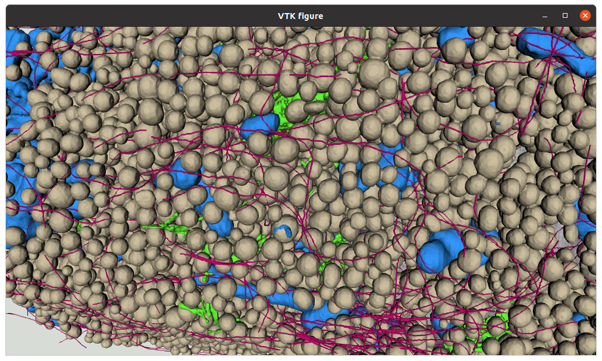

# CellSketch quickstart commandline

## Aim of this document

This guide will cover the basic steps to get from TIFF masks to a Blender rendering using the CellSketch components from the commandline. 

## Installation

We are using [Album](https://album.solutions) to run the different CellSketch components.

### Install Album

Given that you already you already have a working conda / mamba / micromamba setup, run the following command:
```
conda create -n album album -c conda-forge
```

Alternative installation instructions are described [here](https://docs.album.solutions/en/latest/installation-instructions.html).

Activate the album environment before running the other commands in this guide:
```
conda activate album
```

### Add the Helmholtz Imaging Development Catalog

```
album add-catalog https://gitlab.com/album-app/catalogs/helmholtz-imaging
```

### Install CellSketch solutions

Install these CellSketch solutions by running the following commands:
```
album install de.mdc-berlin:cellsketch-create:0.1.0
album install de.mdc-berlin:cellsketch-add-mask:0.1.0
album install de.mdc-berlin:cellsketch-mesh-export:0.1.0
album install de.mdc-berlin:cellsketch-mesh-render:0.1.0
album install de.mdc-berlin:launch-blender:0.1.0
```

### Creating a CellSketch project
```
album run de.mdc-berlin:cellsketch-create:0.1.0 --parent MY_PARENT_FOLDER --name MY_PROJECT --input MY_RAW_DATASET.tif --pixel_to_um 0.016 --headless True
```

Parameters:
- `parent`: Choose a folder, let's call it `MY_PARENT_FOLDER`, where your project is going to be created in.
- `name`: This name will represent your project, we will use the placeholder MY_PROJECT in this guide.
- `input`: You need to provide one dataset as the source image, for example your raw dataset from the data acquisition. It will only be used for visualization purposes as the "background image", if you don't have one, you can simply choose one of your masks. You should be able to use any image file format that ImageJ / Fiji can open as well.
- `pixel_to_um`: This is the conversion factor from pixel units to UM units.


A new folder `MY_PARENT_FOLDER/MY_PROJECT.n5` will be created. Please don't rename it.

### Add masks to the project
```
**album run de.mdc-berlin:cellsketch-add-mask:0.1.0 --project MY_PROJECT.n5 --input MY_MASK.tif --name mitochondria**
```
Provide your `MY_PROJECT.n5` directory from the previous step as the project input parameter and the mask you want to add as input, together with a representative name.

### (Optional) Display project in BigDataViewer

Install the following solution:
```
album install de.mdc-berlin:cellsketch-view:0.1.0
```
Now you can run the solution:
```
album run de.mdc-berlin:cellsketch-view:0.1.0 --project MY_PROJECT.n5
```


This will open BigDataViewer and initially always only display the source dataset. The view supports arbitrary rotations in 3D. Hover over the right part of the display - an arrow on the right border will appear. Click on it to show the sidebar of the viewer. After importing other cell components, they can be loaded and displayed by clicking on the eye symbols.

### Exporting meshes for all masks

In order to render a cell in 3D, tools like Blender need mesh representations of your data. You can convert all or a subset of your masks and labels of your CellSketch project into meshes with one solution.

```
album run de.mdc-berlin:cellsketch-mesh-export:0.1.0 --project MY_PROJECT.n5 --headless True
```

### (Optional) Displaying meshes in VTK
Install the following solution:
```
album install de.mdc-berlin:cellsketch-mesh-view:0.1.0
```
Run the solution:
```
album run de.mdc-berlin:cellsketch-mesh-view:0.1.0 --project MY_PROJECT.n5
```



### Import meshes into Blender

All exported meshes can automatically be imported into Blender with the assigned colors to render them with advanced texture and lighting simulations. 

```
album run de.mdc-berlin:cellsketch-mesh-render:0.1.0 --project MY_PROJECT.n5 --output_blend MY_PROJECT.blend --headless True
```

Parameters:
- `project`: Your CellSketch project, the directory ending with `.n5`.
- `output_blend`: The path to where the Blender project file will be stored, useful for further adjustments of the scene. 
- `headless`: This is set to `False` by default, which means the Blender scene will be displayed while importing the meshes. Be aware that the window will be frozen during this process. Set this to `True` to run the process in the background.

### Open and render project in Blender

You can now open the Blender project stored at `output_blend` with Blender - either you already have Blender installed, then just open it there, or use the Album solution:

Run the following command:
```
album run de.mdc-berlin:launch-blender:0.1.0 --input PATH_TO_OUTPUT_BLEND.blend
```


The color of the material of each object can be changed in the `Shading` section in the lower part of the user interface.
Adjustments to the rendering can be done after selecting the `Rendering` workspace in the top center area. Select `Cycles` in the right area as Render Engine for enhanced material rendering. GPU devices can be configured by clicking `Preferences > System > Cycles Render Devices`.

Click `Render > Render image` in the top menu to render the cell.

Alternatively, render the image via command line without displaying the Blender GUI with this call:
```
album run de.mdc-berlin:launch-blender:0.1.0 --input PATH_TO_OUTPUT_BLEND.blend --output_rendering PATH_TO_OUTPUT_IMAGE
```


